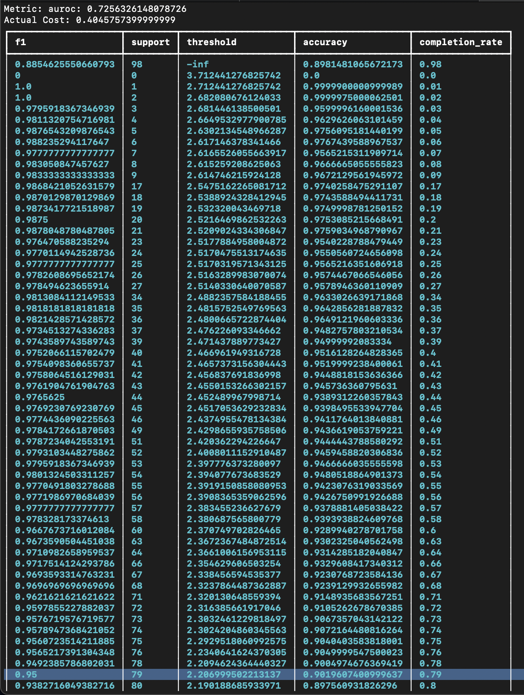

# Confidence

<figure markdown>
  { width="600" }
  <figcaption>ChatGPT summarizing a non-existent New York Times article even without access to the Internet</figcaption>
</figure>

One of the biggest criticisms of using a LLMs so far has been hallucinations - LLMs can seem very confidence in their language even when they are completely incorrect. `autolabel` provides a confidence score for each LLM output that is correlated with the likelihood of that output being incorrect, i.e. if the confidence score is high, then it is more likely that the output is correct, and if confidence score is low, it is likely that the LLM has produced an incorrect output. 

## Computing Confidence Scores

The `autolabel` library today relies on token level probabilities, also known as logprobs, to compute confidence scores. However, very few models today return token level probabilities alongside prediction. Out of all models supported by `autolabel` today, only the `text-davinci-003` model by `openai` can return logprobs. For all other models, Refuel has setup an in-house API to generate logprobs for a specific prediction given an input, regardless of the language model that was originally used to query for the prediction. For `text-davinci-003`, we use the logprobs returned by `openai`'s API instead of querying our in-house API.

Generating confidence scores is simple - setting the key `compute_confidence` to `True` in the `model` dictionary of the config should initiate confidence score retrieval. Here is an example:

```python
{
    "task_name": "PersonLocationOrgMiscNER",
    "task_type": "named_entity_recognition",
    "dataset": {
        "label_column": "CategorizedLabels",
        "text_column": "example",
        "delimiter": "%"
    },
    "model": {
        "provider": "anthropic",
        "name": "claude-v1",
        "compute_confidence": True
    },
    "prompt": {
        "task_guidelines": "You are an expert at extracting entities from text.",
        "labels": [
            "Location",
            "Organization",
            "Person",
            "Miscellaneous"
        ],
        "example_template": "Example: {example}\nOutput: {CategorizedLabels}",
        "few_shot_examples": "../examples/conll2003/seed.csv",
        "few_shot_selection": "semantic_similarity",
        "few_shot_num": 5
    }
}
```

In the above example, by setting `compute_confidence` to True, `autolabel` will start calling Refuel's api to generate token level probabilities and compute confidence scores for each prediction. In order for this to run successfully, ensure that the following setup has been completed:

Set the following environment variable:
```
export REFUEL_API_KEY=<your-refuel-key>
```
replacing `<your-refuel-key>` with your API key, which you can get from [here](https://refuel-ai.typeform.com/llm-access)

## Interpreting Scores

To see how confidence scores can be used to make a tradeoff between task performance and completion rate, let's take a look at the following example:

<figure markdown>
  { width="600" }
  <figcaption>Library output when confidence is enabled</figcaption>
</figure>

`autolabel` outputs a table consisting of metrics at various confidence thresholds when `compute_confidence` is set to `True`. Specifically, this is the table we get when we label 100 examples from the CONLL-2003 dataset with semantic similarity enabled. The first row in the table corresponds to the overall performance: we were able to successfully label 98% of examples at an F1 score of 0.885. However, we can use this table to decide on a confidence threshold to accept predictions at and increase our metrics. For example, note that according the highlighed row, if we accept labels with confidence scores above ~2.207, we can boost our F1 score to 0.95 while reducing completion rate to 79%. 